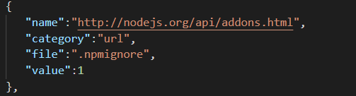
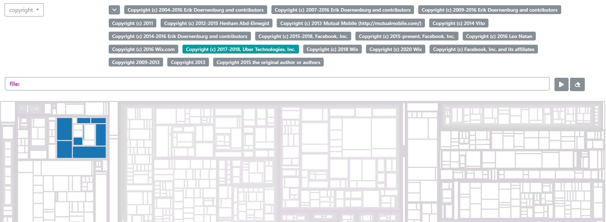

# ScanCode-Plugin


## About

This is a **ScanCode post-scan plugin** that generate a JSON property file, containing information about **CPLUE** (Copyrights, Packages, Licences, URLS, Emails), based on the project you run this plugin on, different from the default options, which is also compatible with dxplatform. \
It is important to know if a project has any **Copyrights, Licences, Packages** that you should be aware of and you can easily find any **Emails** and **Urls** used in your files. \
It is written in Python and does not work on its own, meaning it needs to have scancode-toolkit installed.

## Before Installing

ScanCode requires either **Python** 3.6.x and is tested on Linux, Mac, and Windows.
Make sure Python 3.6 is installed first. Also keep in mind that this plugin was written for the latest release and it may not work on previous ones.

## Installation

**1. Install scancode-toolkit**

```
git clone https://github.com/nexB/scancode-toolkit.git
cd scancode-toolkit
```

For Linux/Mac:

```
open a terminal in the scancode-toolkit folder
run ./configure
run source bin/activate
```

For Windows:

```
open a command prompt in the scancode-toolkit folder
run configure
run Scripts/activate
```

For further information you can also read [ScanCode's documentation](https://scancode-toolkit.readthedocs.io/).

**2. Install the plugin**

Go into the **scancode-toolkit** folder and open a terminal/command prompt.

```
mkdir plugins
cd plugins
```

Then you need to clone the project via Git:

```
git clone https://github.com/TeamFrost/scancode-plugin.git
cd scancode-plugin
```

Finally, you need to load the plugin by opening a terminal/command prompt and running:

For Linux/Mac:

```
pip install .
```

For Windows:

```
python -m pip install .
```

## Docker

You can use Docker to install scancode-toolkit by following the steps [here](https://scancode-toolkit.readthedocs.io/en/latest/getting-started/install.html#docker-install). Currently we are working on our own image which also includes the plugin that you can find [here](https://hub.docker.com/r/simonesiss/scancode-plugin).
You can also use the Dockerfile to build the image, but you will have to do that by also cloning the scancode-toolkit repository and adding our plugin, just like the instructions above. Just replace the Dockerfile from scancode with ours and build the image (in the scancode-toolkit directory):

```
docker build -t scancode-toolkit .
```

To run the tool you can follow the instructions [here](https://scancode-toolkit.readthedocs.io/en/latest/getting-started/install.html#docker-install).

## Usage

To run scancode you should open a terminal/command prompt in its root directory and you can start with the help command to see all the options you have.

```
scancode --help
```

If you installed our plugin correctly it should appear under the **post-scan** section with the command:

```
--jsonprop
```

If you the plugin is not working and you cannot see it in the _--help_ section you can try running _configure_ again in the root folder of scancode-toolkit. You can also try with _pip install scancode-toolkit_ or _python -m pip install scancode-toolkit_ for Windows users.

To run your first scan you can try:

```
scancode -cplue <path to the directory you want to scan> --jsonprop --json-pp <path to the output file>
```

**We strongly recommend that you use the _--ignore_ command to not run the scan for huge files, such as package-lock.json.**

The first _-cplue_ instructs scancode to look for copyrights, packages, licenses, urls and email. After, our custom command for the plugin _--jsonprop_ generates a **result.json** file in the root directory of scancode. The file is not formatted and you should use an online converter to a prettier JSON if you want to better understand it. The files contains the following information:

| name                           | category  | path             | value |
| ------------------------------ | --------- | ---------------- | ----- |
| string of the actual **email** | email     | path to the file | 1     |
| string of the actual **url**   | url       | path to the file | 1     |
| value of the **copyright**     | copyright | path to the file | 1     |
| name of the **license**        | license   | path to the file | 1     |
| name of the **package**        | package   | path to the file | 1     |

The path is without the root folder for purpose of integration with dxplatform. Also, likewise, the existence of the value field is motivated by the wanted integration.

Lastly, to see the results provided by scancode you should open the file that you included in the command. Moreover, if you want this results to be seen in the terminal / command prompt you can replace _<path to the output file>_ with _-_.

## Dx Platform

After you have you **result.json** file generated you can upload the file to Dx Platform and see where in your files you can find emails, urls, licenses, copyrights or packages. Just keep in mind that you can run commands on scancode just for the things that interest you, for exemple by only searching for emails, the file will contain just emails. You can also make any combination of the 5 parameters to fulfill your search.

## Screenshots

In the photo below you can see how the JSON is formatted after you run our plugin. You can identify the type by looking at _category_



Here we can see how relevant is this in the Dx Platform and how easy we can identify which files use a license.



## Thanks

This plugin would not be possible without [nexB/scancode-toolkit](https://github.com/nexB/scancode-toolkit), so we would like to thank them for their work and be sure to also check them out.

## License

[Apache-2.0 License](LICENSE)
